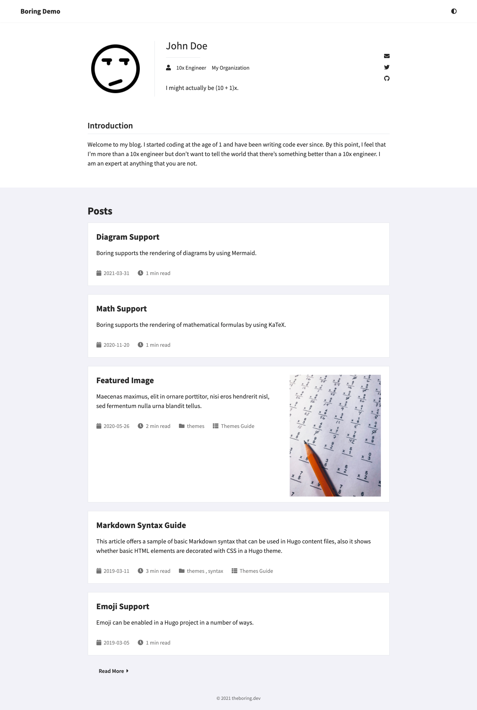

# hugo-boring

Boring is a minimal theme for [Hugo](https://gohugo.io/) and is a fork of the feature-rich and highly customizable theme [Eureka](https://www.wangchucheng.com/en/docs/hugo-eureka/).

Boring is opinionated and is used for my [personal blog](https://theboring.dev).

## Boring Preview



**Note of Caution**: I do not intend to add any extra features that are not going to be used in my personal blog. If you do want to extend the theme and your own features, please fork the repository.

## Try Boring

- Install [hugo](https://gohugo.io/getting-started/installing/).

- Clone the repository.

    ```bash
    git clone git@github.com:mesaugat/hugo-boring.git
    ```

- Install dependencies.

    ```bash
    cd hugo-boring
    npm install
    npm install -g postcss postcss-cli autoprefixer
    ```

- Navigate to `exampleSite/` and start hugo server.

    ```bash
    cd exampleSite
    hugo server
    ```

## License

[Apache License, Version 2.0](LICENSE)

Original License under [Apache License, Version 2.0](https://github.com/wangchucheng/hugo-eureka/blob/master/LICENSE)
